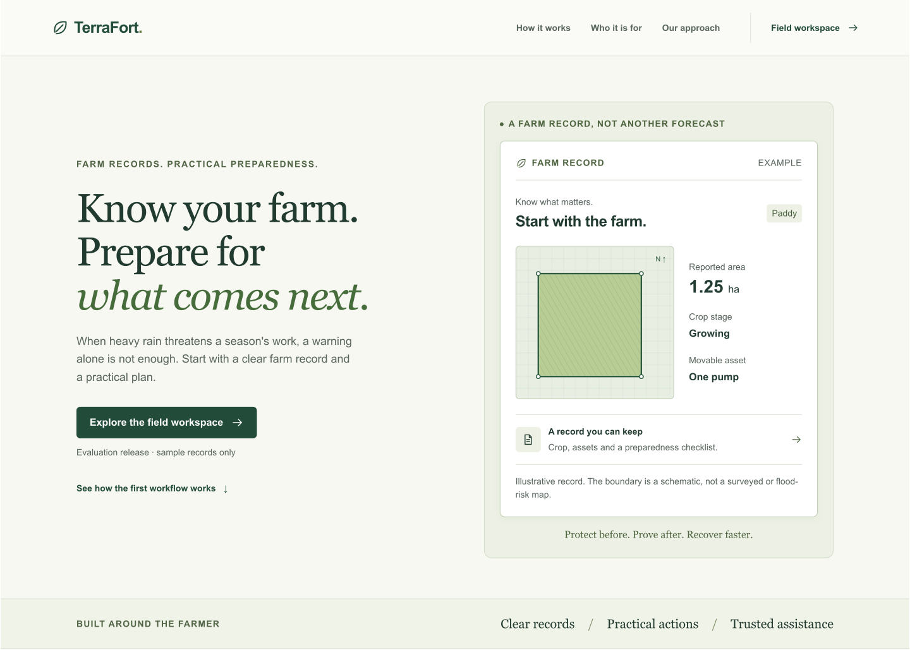

  
  
<strong>Protect before. Prove after. Recover faster.</strong>

  
Farm records and practical preparedness, built around the farmer.

  

## The problem

A flood warning tells a farmer what may happen. It rarely tells them which equipment to move, where the farm documents are, or what information they will need if the crop is damaged.

Farm details, preparations and recovery records are often kept separately. The farmer has to repeat the same information to field workers, local organisations and institutions, sometimes when time and connectivity are already limited.

TerraFort starts with that gap: a clear farm record that can become a practical action plan and, later, a record of damage and recovery.

## What TerraFort does

TerraFort is an assisted agricultural preparedness and recovery project. Its starting focus is crop farmers in one flood-prone Bihar district, working through field workers and local organisations. The district and institutional partner have not yet been confirmed.

The current product connects three steps:

| Step | What happens |
| --- | --- |
| Know the farm | Record the crop, growth stage, reported area, movable assets and plot boundary with permission. |
| Make a plan | Keep a preparedness checklist alongside the farm and save which actions have been completed. |
| Keep the record | Produce a farmer summary with the saved details, consent date and a schematic plot boundary. |

The public homepage explains this workflow. The separate field workspace handles the records and actions.

For local sample evaluation, the registration form can keep a partial draft or a fixed pending submission in the browser. Pending copies are sent only on request; retrying the same copy does not create a second farm when a response is lost. This is not full offline operation or approved storage for real farmer information.

## Who it is for

**Farmers and households** need a record they can understand with a trusted field worker. The intended farmer service is free or institution-sponsored.

**Field workers** need one consistent way to register a farm, record consent and keep its preparations together.

**FPOs and local organisations** need a foundation for understanding member farms before coordinating a wider preparedness programme.

## How the product works

The React interface submits a farm record to a Spring Boot API. The API validates the information and saves the farm, consent record, initial actions and audit event in one PostgreSQL transaction. A repeated registration request returns the same record rather than creating a duplicate.

Checklist updates save the requested completion state. The farmer summary reads the saved records. Organisation-level access checks are enforced by the API; a boundary drawing or browser control is never treated as authorisation.

The public homepage is rendered during the build and does not need the farm API. Farm records are loaded only when the field workspace is opened.

## The wider direction

The product blueprint follows the full chain: risk, local action, completion evidence, damage evidence and recovery. Validated warnings, approved local playbooks, offline capture and authorised recovery hand-offs are planned work, not current integrations.

## Trust comes first

The current workspace is an evaluation release for sample records. Its checklist is illustrative and needs local expert approval before field use. It is not a live flood-warning, insurance or emergency service.

A farm record does not confirm insurance cover, predict a flood or guarantee compensation. Permission to keep a record does not automatically permit sharing it with a bank or insurer. Software cannot stop a flood; official authorities take priority during an emergency.

[Product blueprint](terrafort-complete-blueprint.md) · [Architecture](docs/decisions/0001-foundation.md) · [API contract](docs/openapi.yml) · [Developer guide](docs/development.md)
